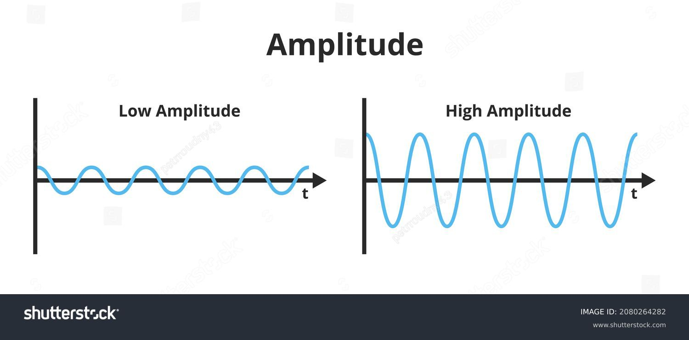

# **What is Amplitude/**

Amplitude in digital audio refers to the loudness of a sound. A high amplitude means a louder sound and a low amplitude means a quieter sound. Recording amplitude levels depends on the bit depth.

[Navigate back to the homepage](README.md)

stock-vector-vector-scientific-illustration-of-the-amplitude-of-a-wave-isolated-on-a-white-background-the-2080264282.jpg
